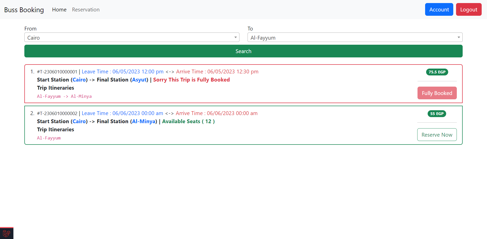
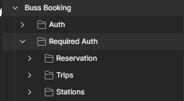
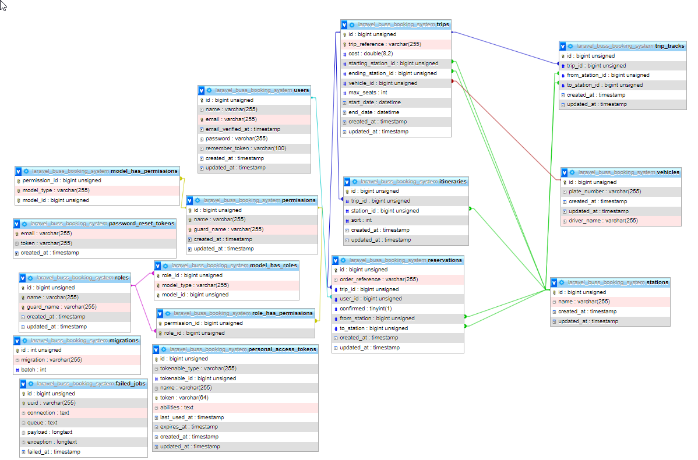
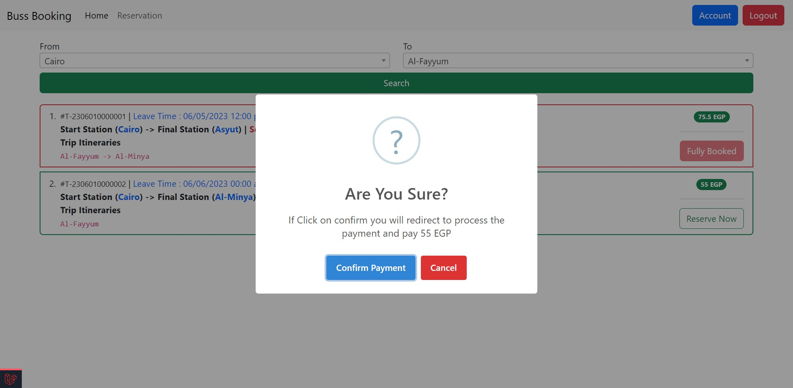
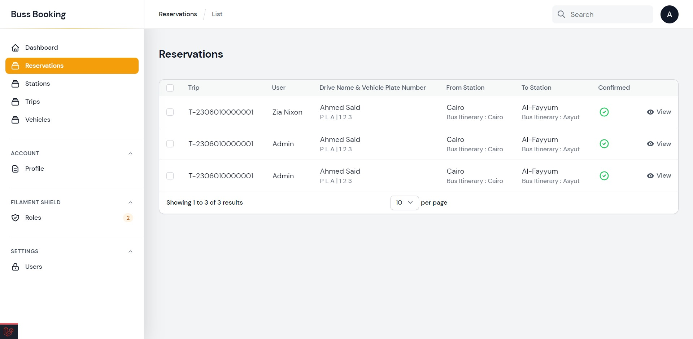
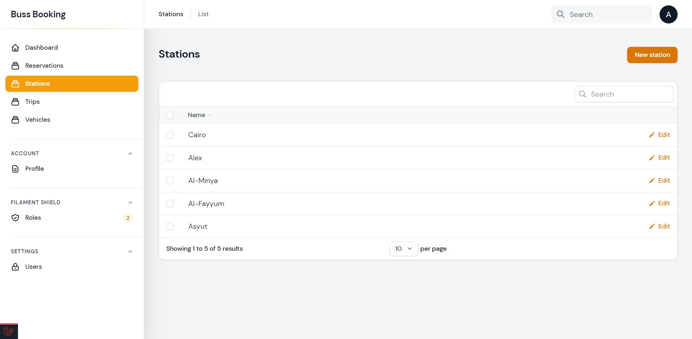
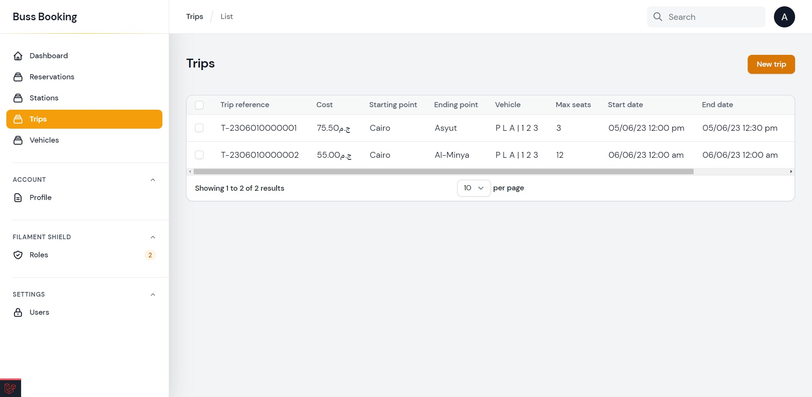
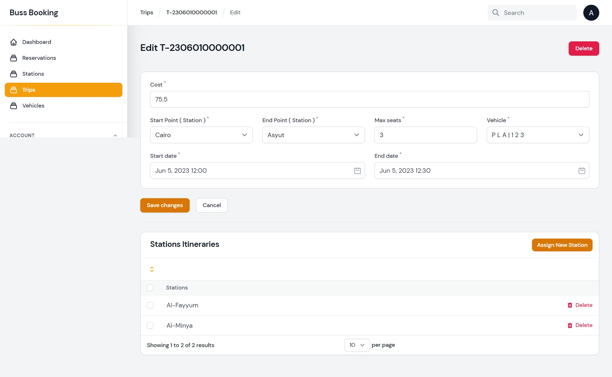
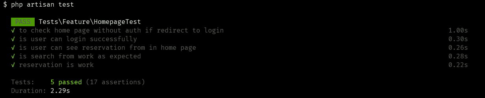

<h1 align="center">Buss Booking System</h1>

<!-- TABLE OF CONTENTS -->
<details open="open">
  <summary><h2 style="display: inline-block">Table of Contents</h2></summary>
  <ol>
    <li>
      <a href="#about-the-project">About The Project</a>
      <ul>
        <li><a href="#built-with">Built With</a></li>
      </ul>
    </li>
    <li>
      <a href="#getting-started">Getting Started</a>
      <ul>
        <li><a href="#prerequisites">Prerequisites</a></li>
        <li><a href="#installation">Installation</a></li>
      </ul>
    </li>
    <li><a href="#usage">Usage</a></li>
    <li><a href="#api">API</a></li>
    <li><a href="#digram">Database Digram</a></li>
    <li><a href="#testing">Testing</a></li>
    <li><a href="#images">Images</a></li>
    <li><a href="#contributing">Contributing</a></li>
    <li><a href="#license">License</a></li>
  </ol>
</details>

<!-- ABOUT THE PROJECT -->

## About The Project



### Built With

- Laravel V10.13.0
- Filament V2.17.44
- Bootstrap V5.3.0

<!-- GETTING STARTED -->

## Getting Started

To get a local copy up and running follow these simple steps.

### Prerequisites

This is an example of how to list things you need to Prepare.

- Local Server Or Live Server
- PHP Version 8.1.7
- `Composer` [Download From Here](https://getcomposer.org/download)
- Command Line and I prefer `Git Bash` You Can download it [From Here](https://git-scm.com/downloads)

<hr>

### Installation

- Clone the repo
  ```sh
  git clone https://github.com/EGYWEB-Mohamed/Buss-booking-system.git
  ```
- Install Required packages With `composer`
  ```sh
  composer install
  ```
- Copy .env.example file and rename it with .env
  ```sh
    cp .env.example .env
  ```
- Generate Key
  ```ssh
  php artisan key:generate
  ```
- Create Two Database

    - Testing `DB_TEST_DATABASE`
    - Live `DB_DATABASE`

- Fill `.env` File With Important Data

  ```sh
  DB_DATABASE=
  DB_USERNAME=
  DB_PASSWORD=
  ```

- Then Run To Migrate All Database Also to seed with dummy data
  ```ssh
  php artisan migrate --seed
  ```
    - Account Credential
      - Admin
        ```
        Email : admin@test.com
        Password :  123456789
        ```
      - Client
        ```
        Email : client@test.com
        Password :  123456789
        ```
- If your using local server don't forget to run `php artisan serv` or you can navigate from localhost correct
  installation path


- Want To Test The Whole Application and functionality ? <a href="#testing">Easy Jump To This Part</a>

<hr>

<!-- USAGE EXAMPLES -->

## Usage

Robusta studio wants to build a fleet-management system (bus-booking system) Having:

- Egypt cities as stations [Cairo, Giza, AlFayyum, AlMinya, Asyut...]
- Predefined trips between 2 stations that cross over in-between stations.
  ex: Cairo to Asyut trip that crosses over AlFayyum -firstly- then AlMinya.
- Bus for each trip, each bus has 12 available seats to be booked by users, each seat has an unique id.
- Users can book an available trip seat.

  For example we have Cairo-Asyut trip that crosses over AlFayyum -firstly- then AlMinya:
  any user can book a seat for any of these criteria
  (Cairo to AlFayyum), (Cairo to AlMinya), (Cairo to Asyut),
  (AlFayyum to AlMinya), (AlFayyum to Asyut) or
  (AlMinya to Asyut)
  if there is an available seat, taking into consideration if the bus is full from Cairo to
  AlMinya, the user cannot book any seat from AlFayyum but he can book from AlMinya.
  We require the following:
  Implement a solution for this case using a Relational-Database and Laravel web app that
  provides 2 APIs for any consumer(ex: web app, mobile app,...)
  - User can book a seat if there is an available seat.
  - User can get a list of available seats to be booked for his trip by sending start and end
  stations.

<!-- USAGE EXAMPLES -->
<hr>

## Api

The System integrated with ready to use API. Just download [This collection](Buss%20Booking.postman_collection.json) and open it with [Postman](https://www.postman.com/).

Also, here's live [Documentation](https://documenter.getpostman.com/view/7501952/2s93sW8abr).



*Note* Required Auth Directory is required Bearer Token So pass it

<hr>

## Digram



<hr>

## Images






<hr>

## Testing

When You Finish Setup the application you can easily run

  ```ssh
  php artisan test
  ```



You Got Green Pass So What you are waiting for 😂

<br>

#### Test Cases Coverage:
✔️ Check home page without auth if redirect to log in ? <br>
✔️ is user can log in successfully ? <br>
✔️ is user can see reservation from in home page ? <br>
✔️ is search from work as expected ? <br>
✔️ is reservation work ? <br>

<b>5 Test Case With 17 assertions</b>

## Contributing

Contributions are what make the open source community such an amazing place to be learn, inspire, and create. Any
contributions you make are **greatly appreciated**.

1. Fork the Project
2. Create your Feature Branch (`git checkout -b feature/AmazingFeature`)
3. Commit your Changes (`git commit -m 'Add some AmazingFeature'`)
4. Push to the Branch (`git push origin feature/AmazingFeature`)
5. Open a Pull Request

<!-- LICENSE -->

## License

Distributed under the MIT License. See `LICENSE` for more information.
